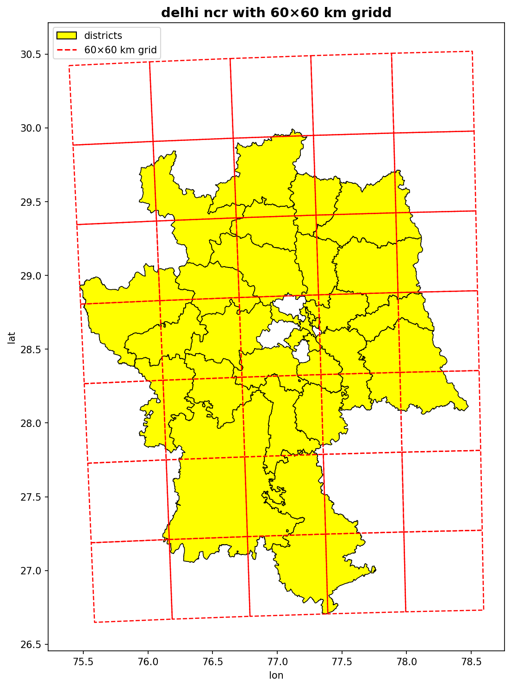
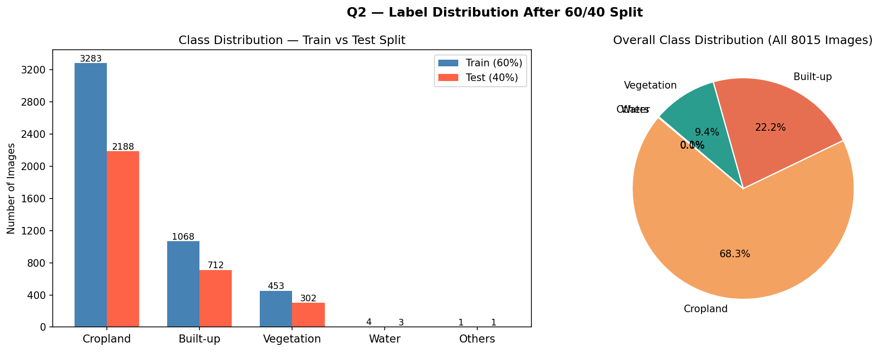
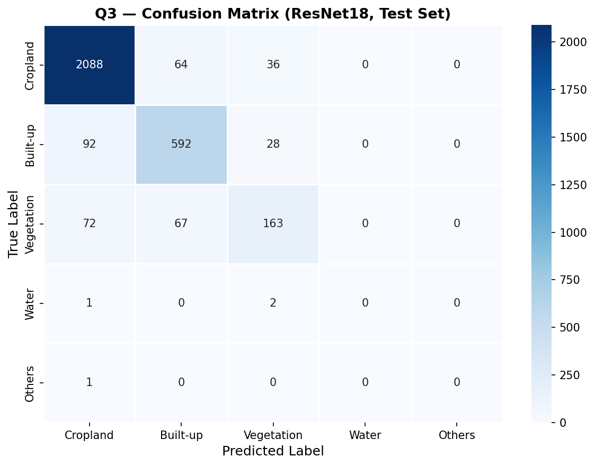
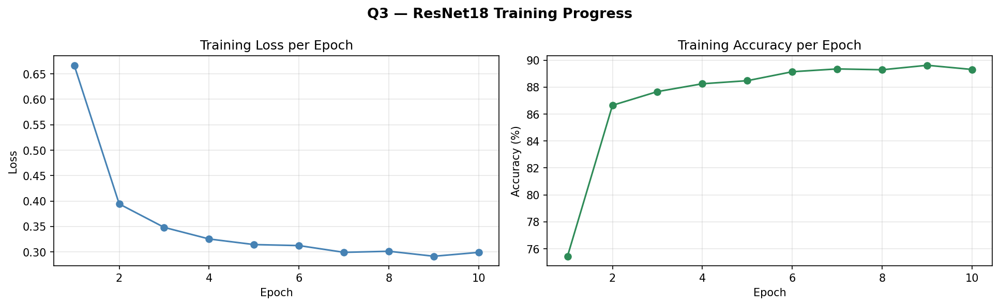

# Earth Observation: Delhi Airshed Land Use Classification

Land use and land cover (LULC) classification over the Delhi-NCR region using Sentinel-2 satellite imagery and transfer learning with ResNet18. Labels are sourced from the ESA WorldCover 2021 dataset, which provides 10m resolution global land cover maps across 11 classes.

The task is to classify 128x128 pixel satellite patches into land cover categories such as cropland, built-up area, vegetation, and water — using only the RGB bands from Sentinel-2.

---

## Dataset

- Source: Sentinel-2 RGB patches (128x128px, 10m/pixel), ESA WorldCover 2021
- Region: Delhi-NCR (EPSG:4326)
- Total patches before filtering: 9216
- Patches inside Delhi-NCR boundary: 8015
- Train / Test split: 60% / 40%

---

## Results

| Metric | Value |
|---|---|
| Model | ResNet18 (transfer learning, ImageNet pretrained) |
| Test Accuracy | 88.68% |
| F1-Score (weighted) | 0.8827 |
| F1-Score (macro) | 0.4758 |

**Per-class F1:**

| Class | F1-Score |
|---|---|
| Cropland | 0.94 |
| Built-up | 0.83 |
| Vegetation | 0.61 |
| Water | 0.00 |
| Others | 0.00 |

Low F1 on Water and Others reflects severe class imbalance in the Delhi-NCR region - these classes make up a very small fraction of total patches. The weighted F1 (0.88) is a better representation of overall model performance given this imbalance.

---

## Visualizations

| Delhi-NCR Grid | Class Distribution | Confusion Matrix | Training Curve |
|---|---|---|---|
|  |  |  |  |

---

## Stack

| Component | Tool |
|---|---|
| Satellite data | Sentinel-2 (RGB bands) |
| Labels | ESA WorldCover 2021 |
| Geospatial processing | GeoPandas, Rasterio |
| Model | ResNet18 (PyTorch) |
| Evaluation | Scikit-learn |
| Platform | Google Colab |
